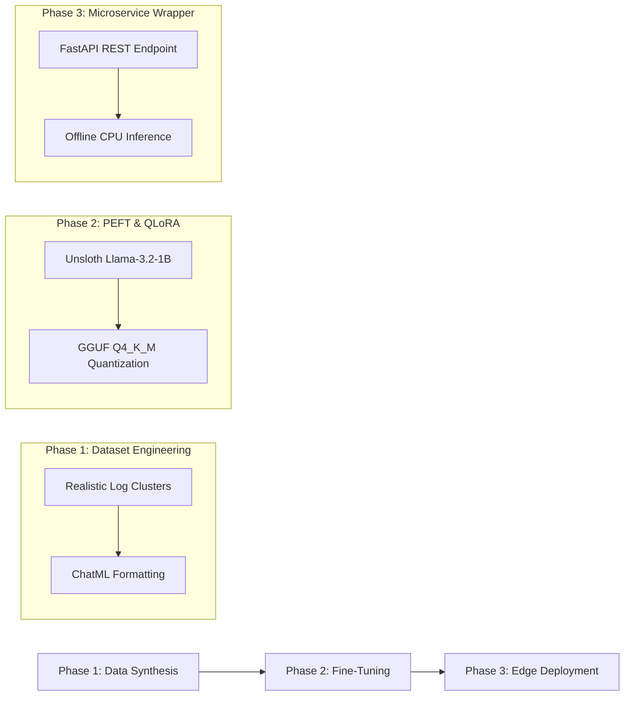

# Fine-Tuned-Log-to-JSON-Parser 🛡️


**An offline AI microservice and edge logging firewall that parses raw, unstructured backend logs into deterministic, PII-redacted JSON telemetry.**

---

## 📌 Overview (The "Why")

In modern microservice architectures, backend applications generate massive volumes of unstructured, multiline log streams (e.g., stack traces, routine health checks, and debug chatter). Routing these raw streams directly to centralized observability platforms or cloud-based LLMs introduces three critical problems:
1. **Exorbitant API & Storage Costs**: Paying to process routine `INFO` chatter or multiline noise at central ingestion points.
2. **Sensitive Data Leaks**: Unintentionally transmitting **Personally Identifiable Information (PII)**—such as JWTs, database connection strings, email addresses, and API keys—outside the secure network perimeter.
3. **AI Hallucination & Latency**: General-purpose cloud LLMs are slow, costly, and prone to schema hallucination when asked to parse strict telemetry payloads under high concurrency.

**Fine-Tuned-Log-to-JSON-Parser** solves this by embedding a specialized, fine-tuned **1-Billion parameter edge AI model** directly adjacent to production services. Running entirely offline on CPU using **llama.cpp**, it filters out benign noise, redacts sensitive credentials, and guarantees strict, deterministic JSON outputs without requiring a dedicated GPU or external cloud APIs.

---

## 🏗️ Architecture & Approach

Our implementation follows a rigorous **3-phase engineering lifecycle**, going from raw log synthesis to offline edge inference:



### Phase 1: Data Synthesis (`scripts/`)
- **Realistic Dataset Engineering**: Generated 500 multiline log clusters representing real-world failure modes (`PubSubFailure`, `DatabaseTimeout`, `AuthExhaustion`), multiline stack traces, and routine health checks.
- **ChatML Standardization**: Structured raw logs and ground-truth telemetry targets into **Hugging Face ChatML** format, establishing a clean 80/20 train/test split.

### Phase 2: Fine-Tuning (`notebooks/`)
- **Parameter-Efficient Fine-Tuning (PEFT)**: Fine-tuned **Llama-3.2-1B-Instruct** using **QLoRA** via **Unsloth** (`r=16`, `lora_alpha=16`), targeting all primary attention and projection layers.
- **Optimization Strategy**: Employed the **8-bit Adam optimizer (`adamw_8bit`)** and **Gradient Accumulation** to achieve stable convergence across 100 training steps without overfitting.
- **Trigger Key Locking**: Used strict **ChatML formatting** to lock down our system prompt as an invariant "trigger key," enforcing exact schema compliance.
- **GGUF Quantization**: Merged LoRA adapters into the 16-bit base model and quantized the artifact into a **4-bit GGUF format (`Q4_K_M`)**, compressing the memory footprint to ~700MB for zero-GPU execution.

### Phase 3: Edge Deployment (`app/`)
- **FastAPI Microservice Wrapper**: Exposed the quantized GGUF model via an asynchronous **FastAPI** REST endpoint (`/distill_logs`).
- **Offline CPU Inference**: Embedded **llama-cpp-python** C++ bindings directly into the application server, allowing sub-second inference entirely inside local memory (`n_gpu_layers=0`).

---

## 📂 Project Structure

```text
Fine-Tuned-Log-to-JSON-Parser/
├── app/
│   ├── main.py                   # FastAPI application wrapper running offline llama.cpp inference
│   └── test_sender.py            # Test script simulating realistic multiline error logs sent via HTTP POST
├── data/
│   ├── raw_logs/                 # Raw multiline production log clusters (.jsonl)
│   ├── processing_chunks/        # Intermediate ETL text chunks wrapped in <LOG_START>/<LOG_END> blocks
│   ├── target/                   # Ground-truth telemetry schema JSON targets
│   └── training/                 # Final ChatML dataset splits (`train_data.jsonl` & `test_data.jsonl`)
├── models/
│   └── llama-3.2-1b-instruct.Q4_K_M.gguf  # Quantized 4-bit edge model (~807MB, excluded from Git)
├── notebooks/
│   └── edge_training.ipynb       # End-to-end Unsloth QLoRA training and GGUF export workflow
├── scripts/
│   ├── generate_logs.py          # Synthetic production log dataset generator
│   ├── prepare_chunks.py         # Batch ETL chunk preparation utility
│   └── build_dataset.py          # ChatML formatter and train/test partitioner
├── .gitignore                    # Excludes virtual environments (.venv) and binary weights (.gguf)
├── requirements.txt              # Core project dependencies
└── README.md                     # Project documentation and architectural overview
```

---

## 🚀 Getting Started (Local Execution)

### 1. Prerequisites & Environment Setup
Clone the repository and install the core application requirements. Make sure your Python environment (Python 3.10+) is active:

```bash
pip install fastapi uvicorn llama-cpp-python requests
```

> [!NOTE]
> The quantized `.gguf` model file (`models/llama-3.2-1b-instruct.Q4_K_M.gguf`) and virtual environments (`.venv/`) are excluded from version control via `.gitignore`. If running from scratch, generate or place your `.gguf` model inside the `models/` folder before launching the server.

### 2. Start the Edge Firewall Server
Launch the asynchronous **FastAPI** server from the project root directory using **Uvicorn**:

```bash
uvicorn app.main:app --reload
```

You should see the server initialize and load the Llama 3.2 model into local CPU memory:
```text
Loading Llama 3.2 Edge Firewall onto CPU from .../models/llama-3.2-1b-instruct.Q4_K_M.gguf...
INFO:     Uvicorn running on http://127.0.0.1:8000 (Press CTRL+C to quit)
```

### 3. Run the Simulated Log Sender
In a separate terminal window, execute the test script to send a simulated multiline critical error log (containing connection pool exhaustion and PII) to the local edge firewall:

```bash
python app/test_sender.py
```

#### Expected Telemetry Output:
```json
{
  "error_type": "ConnectionTimeoutException",
  "affected_service": "auth-service",
  "root_cause": "internal connection pool exhaustion after 30000ms timeout when connecting to database instance",
  "pii_redacted": true,
  "summary": "The auth-service experienced connection pool exhaustion and timed out attempting to check out a database connection pool."
}
```

---


### 🚀 Local Setup

**Note:** The quantized GGUF model is excluded from version control. You must download it before running the application.

1. Clone the repository:
   `git clone https://github.com/your-username/Fine-Tuned-Log-to-JSON-Parser.git`
2. Download the model:
   Download `llama-3.2-1b-instruct.Q4_K_M.gguf` (link to your HuggingFace or source) and place it inside the `models/` directory.
3. Run with Docker:
   `docker build -t log-distiller .`
   `docker run -p 8080:8080 log-distiller`

---

## 🔮 Future Enhancements

- **Containerization (Docker & Multi-Stage Builds)**: Package the FastAPI server and pre-compiled `llama.cpp` C++ binaries into a lightweight, multi-stage Docker container (`Dockerfile.cpu`) for portable edge deployment.
- **Serverless Edge Scaling (GCP Cloud Run)**: Deploy the containerized microservice to **Google Cloud Run** with CPU boost enabled for zero-to-N autoscaling on edge endpoints.
- **Dynamic Schema Validation with Pydantic**: Integrate structured output grammars (`GBNF` grammars in `llama.cpp`) to mathematically enforce runtime adherence to complex Pydantic telemetry models.